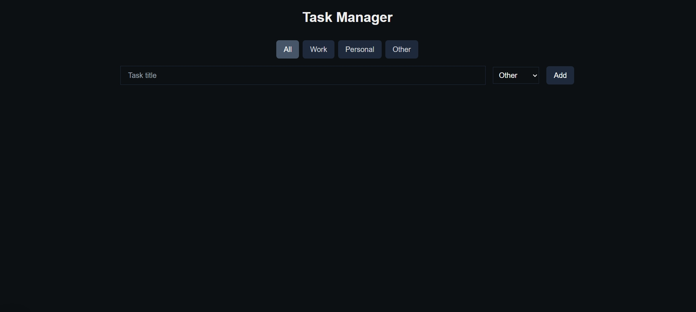

# Todo-Plus

> Gerencie suas tarefas de maneira eficiente

Este projeto foi criado para demonstrar minhas habilidades em Next.js 15, explorando funcionalidades modernas do framework. O Todo-Plus é uma aplicação de gerenciamento de tarefas, desenvolvida para ser simples, responsiva e prática. Ele apresenta recursos como filtros por categoria, edição e exclusão de tarefas, com um design clean e acessível. O objetivo principal é destacar minha capacidade de criar aplicações modernas e funcionais, utilizando boas práticas de desenvolvimento.

## 🚀 Tecnologias

- Next.js 15
- TypeScript
- Axios
- Tailwind CSS
- Git/Github

## 💻 O que aprendi

- Uso prático de layouts aninhados e renderização com React Server Components para melhorar a organização e a performance da aplicação.
- Trabalhei com hooks do React para gerenciar as tarefas de forma eficiente e implementar funcionalidades de filtro, adição, edição e exclusão.
- Criação de uma interface minimalista e funcional, garantindo boa usabilidade em diferentes dispositivos.
- Escrevi um código limpo e reutilizável, seguindo boas práticas de programação e documentação.

## 📨 Contato

- guilhermemillerblack@gmail.com